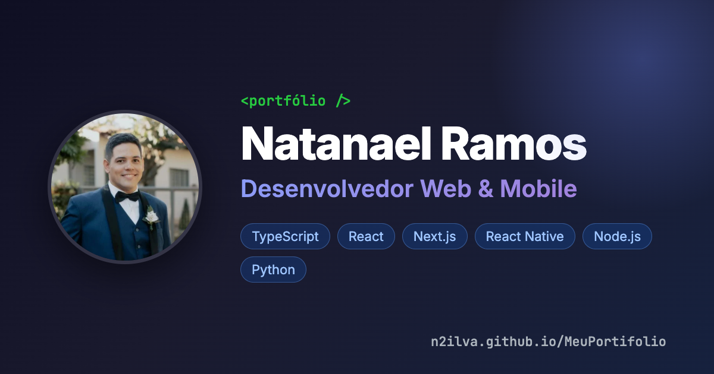

# Portfólio · Natanael Ramos

Portfólio pessoal de desenvolvedor web e mobile, com projetos, habilidades, trajetória e currículo.

**Acesse:** https://n2ilva.github.io/MeuPortifolio/



## Stack

- **Next.js 16** (App Router) com exportação estática, publicado no **GitHub Pages**
- **React 19** e **TypeScript**
- CSS próprio por página, com o reboot do Bootstrap e utilitários enxutos ([app/utilities.css](app/utilities.css))
- Ícones: Bootstrap Icons e SVGs do Devicon
- Fontes Inter e JetBrains Mono via `next/font`

## Destaques técnicos

- **Uma rota por página** (`/projetos/`, `/habilidades/`, `/trajetoria/`, `/contato/`) e uma página gerada para cada projeto (`/projetos/[id]/`) com `generateStaticParams`
- **Conteúdo separado do código:** projetos, tecnologias, trajetória e contatos ficam em [`data/`](data/); perfil e menu em [`config/site.config.ts`](config/site.config.ts)
- **SEO e compartilhamento:** título, descrição e prévia (Open Graph) por página, `sitemap.xml`, favicon e página 404
- **Acessibilidade:** navegação por teclado, link "pular para o conteúdo", rótulos nos ícones e respeito a `prefers-reduced-motion`
- **Desempenho:** imagens em WebP, CSS carregado por página e ícones em SVG em vez de fontes de ícones (Lighthouse: 100 em acessibilidade, boas práticas e SEO)
- **Currículo versionado:** o PDF é gerado a partir de [`curriculo/index.html`](curriculo/)
- **CI/CD:** lint e build no GitHub Actions a cada push na `main`, com deploy automático no GitHub Pages

## Estrutura

```text
app/          Rotas (App Router), layout, metadados, sitemap e ícones
components/   Componentes de cada página e o layout (barra lateral e menu mobile)
config/       Perfil, menu e textos da home
data/         Projetos, tecnologias, trajetória e contatos
curriculo/    Fonte HTML do currículo em PDF
public/       Imagens, ícones e o PDF do currículo
scripts/      Geração do PDF do currículo
utils/        Funções auxiliares (caminho base, metadados)
```

## Rodando localmente

Requer Node.js 20 ou mais recente.

```bash
npm ci
npm run dev        # http://localhost:3000
```

| Comando | O que faz |
| --- | --- |
| `npm run dev` | Servidor de desenvolvimento |
| `npm run build` | Gera o site estático em `out/` |
| `npm run lint` | ESLint |
| `npm run curriculo` | Gera `public/Natanael-Ramos-Curriculo.pdf` a partir de `curriculo/index.html` (usa o Chrome instalado) |

## Como atualizar o conteúdo

- **Novo projeto:** adicione um item em [`data/projects.ts`](data/projects.ts) e a imagem em `public/projetos/`. A página do projeto, o card e o sitemap são gerados automaticamente.
- **Nova tecnologia:** adicione em [`data/technologies.ts`](data/technologies.ts) e o SVG em `public/icons/tech/` (baixe o SVG em [devicon.dev](https://devicon.dev)).
- **Currículo:** edite [`curriculo/index.html`](curriculo/index.html) e rode `npm run curriculo`.

## Contato

- LinkedIn: [linkedin.com/in/natanael2ilva](https://www.linkedin.com/in/natanael2ilva)
- E-mail: natanaelsantos_silva@outlook.com
